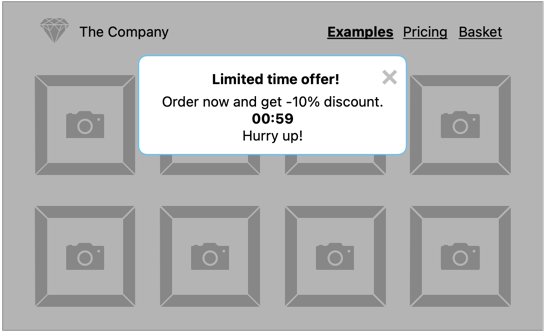
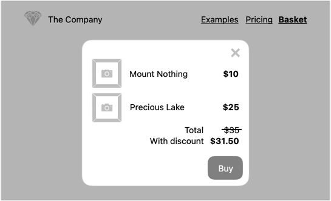

# Projekt: JavaScript – Asynchroniczność

Ciąg dalszy rozbudowy projektu [HTML i CSS](https://github.com/infoshareacademy/jfdzr12-project-html-css)

## Rabat

Zanim użytkownik opuści stronę, będziemy chcieli go zatrzymać, przyznając rabat.

W tym calu wyświetlmy informację o ograniczonej czasowo ofercie.

Rabat powinien zostać przyznany natychmiast, ale wygasnąć po upływie np. 1 minuty.
Poinformujmy o tym użytkownika, dodając tykający zegar do powiadomienia.

Notyfikacja z informacją o rabacie powinna zostać zamknięta automatycznie po upływie 10 sekund, jeśli użytkownik nie zrobi tego wcześniej samodzielnie. 

---

**Wskazówka**

W celu wyświetlenia informacji o przyznanym rabacie:
1. nasłuchuj na zdarzenie [mouseout](https://developer.mozilla.org/en-US/docs/Web/API/Element/mouseout_event) na całym oknie (`window`)

   lub

2. ustaw licznik odmierzający czas, po którym notyfikacja zostanie wyświetlona. 

Informację o rabacie przechowaj w [Session Storage](https://developer.mozilla.org/en-US/docs/Web/API/Window/sessionStorage).

---

Jeśli użytkownik zdąży otworzyć koszyk w wyznaczonym czasie, rabat powinien zostać uwzględniony.

