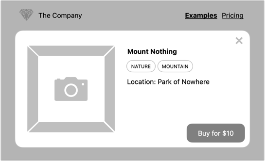
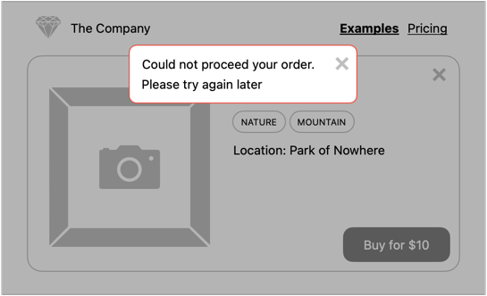

# Projekt: JavaScript - DOM API

Rozbudowa projektu [HTML i CSS](https://github.com/infoshareacademy/jfdzr12-project-html-css)

## Informacje o zdjęciu

Po kliknięciu zdjęcia powinna pojawić się karta produktu zawierająca podstawowe informacje:
- tytuł
- tagi
- lokalizacja
- przycisk zamknięcia karty (po kliknięciu powinna zniknąć)
- przycisk zakupu

Karta powinna zniknąć po wciśnięciu `esc`.

Po kliknięciu przycisku _Kup_ powinien zostać wyświetlony komunikat o wystąpieniu problemu podczas dokonywania zakupu.

