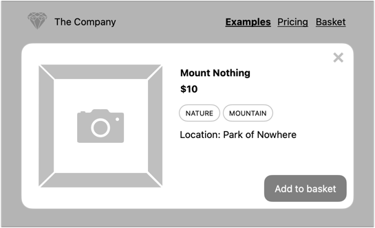
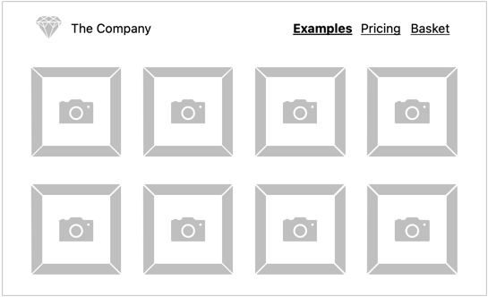
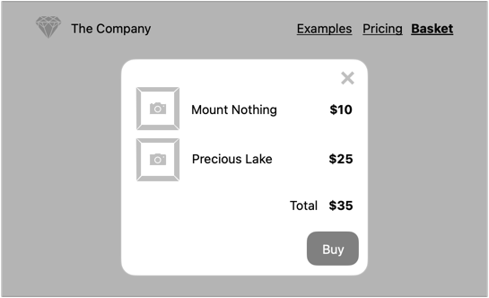

# Projekt: JavaScript – Formularze i Storage API

Ciąg dalszy rozbudowy projektu [HTML i CSS](https://github.com/infoshareacademy/jfdzr12-project-html-css)

## Dodanie produktu do koszyka

[Okienko podglądu zdjęcia](../dom/README.md) powinno zostać zmodyfikowane, by zawierało formularz z:
- niemodyfikowalnym tytułem (nazwą produktu),
- niemodyfikowalną wartością produktu (np. $10),
- przyciskiem dodania do koszyka.

Po kliknięciu przycisku dodania do koszyka podstawowe informacje o zdjęciu wraz z ceną powinny zostać zapisane w [Local Storage](https://developer.mozilla.org/en-US/docs/Web/API/Window/localStorage).

## Złożenie zamówienia

W menu głównym powinien znaleźć się nowy przycisk, który wyświetli produkty dodane wcześniej do koszyka (korzystając ze [Storage API](https://developer.mozilla.org/en-US/docs/Web/API/Storage)).

Po kliknięciu powinno pojawić się okienko w sposób analogiczny do podglądu produktu, a w nim:
- lista zamawianych zdjęć zawierająca:
  - miniaturki,
  - tytuły,
  - ceny,
- kwotę do zapłaty,
- przycisk dokonania zakupu.

Po kliknięciu przycisku zakupu, informacje o koszyku powinny zostać usunięte.
